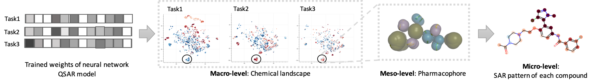
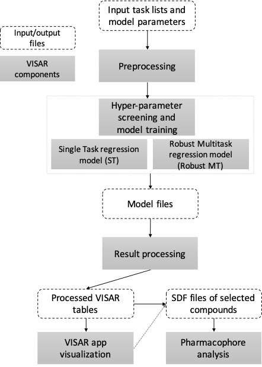
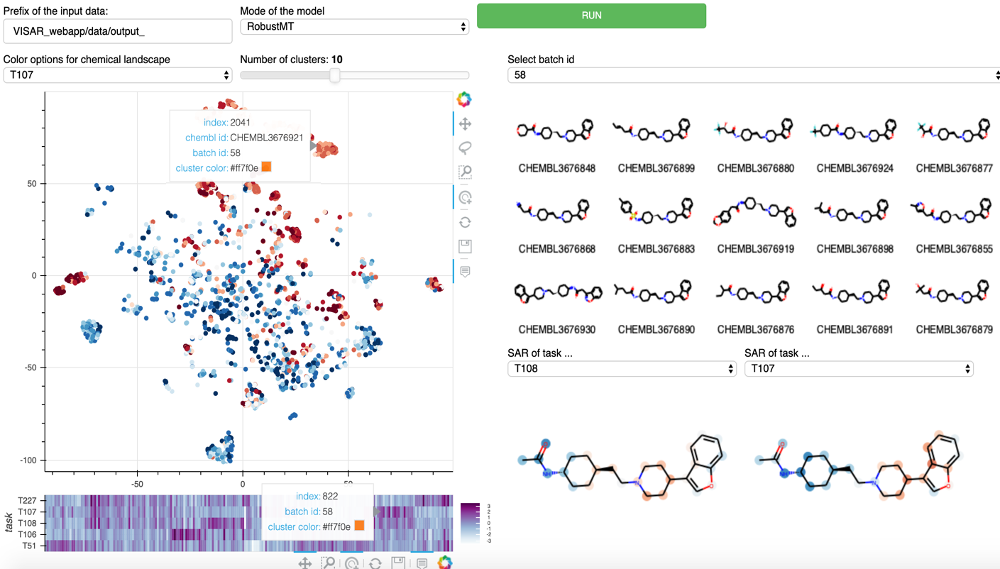

# VISAR

### VISAR: an interactive tool for dissecting chemical features learned by deep neural network QSAR models

Qingyang Ding, Siyu Hou, Songpeng Zu, Yonghui Zhang, Shao Li

Bioinformatics Division and Center for Synthetic and Systems Biology, TNLIST/Department of Automation, Tsinghua University, Beijing 100084, China

School of Pharmaceutical Science, Tsinghua University, Beijing 100084, 
China.

Please contact dingqy14@mails.tsinghua.edu.cn if you have question or suggestions.

## Table of contents  
* [Aims of this project](#aims-of-this-project)
* [Workflow](#workflow)
* [Usage instructions](#usage-instructions)

## Aims of this project

(Back to [Table of contents](#table-of-contents).)

While many previous works focus on improving predictive merits of the models, few looked into the trained model and check if the model is learning what's truly important, as well as link what have been learned by the model back to useful insights.

Here we took a step forward to interpret the learned features from deep neural network QSAR models, and present VISAR, an interactive tool for visualizing structure-activity relationship and the chemical activity landscape based on the learned features, thus providing deeper insights of the neural network 'black-box'.
For a learning task, VISAR firstly provided users with useful functions to build, train and test the deep neural network models.

The rationale of VISAR workflow is shown in the schematic diagram below:



Starting from a series of trained weights of the neural network QSAR models, VISAR provided visualization tools for dissecting the learned chemical features on 3 levels: 1) on the macro-level, compounds with weighted features are clustered and forming different chemical landscapes regarding different tasks; 2) on the meso-level, within each local cluster of chemicals on the chemical landscape sharing similar sturcture and similar activity, pharmacophoric features could be identified; 3) on the micro-level, the SAR pattern is built for each compound regarding each task.

The VISAR workflow features:
- For a learning task, VISAR firstly provided users with useful functions to build, train and test the neural network models.
- The learned parameters of the models were then mapped back as weights of each atom and were visualized as structural-activity relationship (SAR) patterns, demonstrating the positive and negative contributor substructure suggested by the trained model.
- VISAR took the transformed features of the chemicals and build activity landscapes, showing the correlation between the descriptor space after model training and the experimental activity space.
- With the interactive web application of VISAR, users could interactively explore the chemical space  and the SAR pattern for each chemical.
- The clusters of chemicals on the landscape could be then subject to analysis of active pharmacophores. 

We proposed that VISAR could serve as a helpful workflow for training and interactive analysis of the deep neural network QSAR model.

## Workflow

(Back to [Table of contents](#table-of-contents).)



The training, testing and result processing pipeline is available in template jupyter notebooks:

- [Train single task regression model](https://github.com/Svvord/visar/blob/master/Template%20--%20Train%20single%20task%20regresion%20model.ipynb)
- [Train robust multitask regression model](https://github.com/Svvord/visar/blob/master/Template%20-%20Train%20robust%20multitask%20regressor%20model.ipynb)

After the train process, start the app in prompt window by 'bokeh serve --show VISAR_webapp' for interactive exploration.



The generation of SDF file for selected compounds and pharmacophor analysis can be referred to [the template jupyter notebook](https://github.com/Svvord/visar/blob/master/Template%20-%20pharmacophore%20model%20analysis%20for%20selected%20batches.ipynb).


## Usage instructions

(Back to [Table of contents](#table-of-contents).)

1. Get your local copy of the TeachOpenCADD repository (including the template jupyter notebooks) by

- downloading it as zip archive and unzipping it: 

- cloning it to your computer using the package `git`:
```bash
git clone https://github.com/Svvord/visar.git
```

2. For training environment, python=3.5 is recommended, and the environment is depended on: Deepchem, Rdkit, Keras, Tensorflow, Numpy, Pandas, Sklearn, Scipy.

```bash
# Install packages via pip (which is probably installed by default in your environment)
pip install visar
```

3. Preparing the working environment for visualization using Conda is recommended, and is referred to [TeachOpenCADD](https://github.com/volkamerlab/TeachOpenCADD).

```bash
# Create and activate an environment called `visar`
conda create -n visar python=3.6
conda activate visar

# Install packages via conda
conda install jupyter  # Installs also ipykernel
conda install -c rdkit rdkit  # Installs also numpy and pandas
conda install -c samoturk pymol  # Installs also freeglut and glew
conda install -c conda-forge pmw  # Necessary for PyMol terminal window to pop up
conda install -c conda-forge scikit-learn  # Installs also scipy
conda install -c conda-forge seaborn  # Installs also matplotlib
conda install bokeh

# start the web app
cd /path/of/visar
bokeh serve --show VISAR_webapp
```
